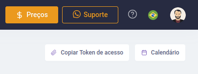
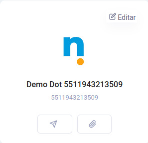
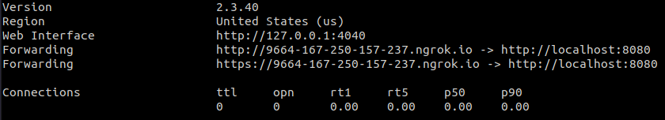
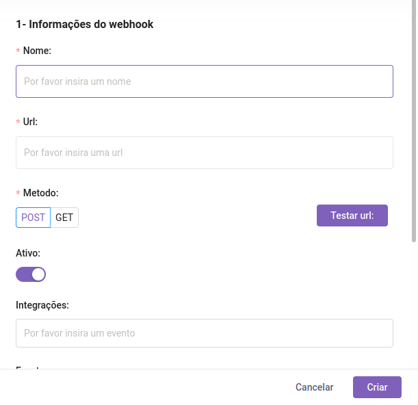

<h1 align="center">Moorse scheduler</h1>

<p align="center">Desenvolvido para facilitar sua forma de agendar notificações!</p>

<p align="center">
  <a href="#Sobre" target="_blank">Sobre</a> • 
  <a href="#Instalação" target="_blank">Instalação</a> • 
  <a href="#Configuração" target="_blank">Configuração</a> • 
  <a href="#Execução" target="_blank">Execução</a> • 
  <a href="#Suporte grátis em Whatsapp, Telegram e Discord" target="_blank">Suporte</a>
</p>

# Sobre :rocket:

O principal objetivo do Moorse scheduler é servir como uma agenda virtual possível de ser utilizada dentro do seu aplicativo do Whatsapp. Ao conversar com nosso Moorsebot, ele lhe permitirá criar, editar e excluir notificações a seu gosto, lhe permitindo escolher data e mensagem a ser enviada.

# Instalação :mag:

Para a devida instalação do Moorse scheduler é necessário que o usuário tenha instalado em sua máquina o interpretador javascript <a href="https://nodejs.org/en/" target="_blank">Node.js</a>, seu gerenciador de pacotes <a href="https://www.npmjs.com/" target="_blank">npm</a>, o SGBD <a href="https://www.postgresql.org/" target="_blank">PostgreSQL</a> e o <a href="https://ngrok.com/" target="_blank">ngrok</a> (caso não seja possível acessar seu computador pela internet), que servirão para a instalação de dependências, execução do código, armazenamento de dados e conexão entre a API do Moorse e seu computador. Também, é de suma importância clonar este repositório do github em sua máquina.

Logo após obter, código, node, npm, PostgreSQL e ngrok, abra o terminal e após estar dentro da pasta do repositório, execute o comando que instala todas as dependências do projeto:

```bash
$ npm install
```

Isso finaliza a etapa de instalação do Moorse Scheduler.

# Configuração :computer:

## 1. Criando conta no site

Para que seja possível utilizar o Moorse scheduler, é, antes de tudo, necessário que o usuário tenha uma conta que pode ser facilmente criada no <a href="https://moorse.io/" target="_blanket">site da Moorse</a>.

Com esta conta, e após ter criado sua integração no site, o usuário deve obter seu <strong>token de autenticação</strong> e o <strong>id da integração</strong> criada do Whatsapp, que serão utilizados para funcionamento do programa.

## 2. Obtendo informações da conta

O <strong>token de autenticação</strong> pode ser obtido ao clicar no botão nomeado de <strong>copiar token de acesso</strong> do canto superior do <strong>dashboard</strong> do site.

</img>

Enquanto isso, o <strong>id da integração</strong> pode ser obtido por meio da página da sua integração, para copiar basta clicar no <i>clipe</i> nomeado de <strong>copiar id da integração</strong>.

</img>

## 3. Adicionando informações da conta ao programa

Com o token e o id em mãos, basta apenas adicionarmos estes dados no programa, vá até o arquivo em `src/config/configs.ts` e lá adicione ambos token e id da integração. Lembre-se de adicionar os dados com as aspas, para que o programa os reconheça como strings, também é possível trocar a porta da aplicação para alguma de sua preferência.

## 4. Adicionando informações do banco de dados

Também, é necessário que o usuário forneça à aplicação o banco de dados criado. De forma semelhante, isso pode ser feito no arquivo `src/config/configs.ts`, informações como nome da base de dados, senha, usuário e porta, são requisitados, basta preencher corretamente para que o programa funcione com êxito.

## 5. Ligando ngrok e configurando webhook

Agora precisamos conectar você e a Moorse, para que possamos lhe enviar informações sobre quando uma nova mensagem chega a seu Whatsapp.

Para ligar o ngrok apenas digite no terminal:

```bash
ngrok http 8080
```

Caso você tenha mudado a porta padrão da aplicação, substitua 8080 pela nova porta, após isso, o ngrok lhe dá uma url possível de ser acessada de qualquer máquina da internet, é o que usaremos para conectar você e a Moorse.

</img>

Agora com a nova URL, é hora de adicionar esta informação ao site da Moorse, para que as informações dos webhooks cheguem ao seu computador e sejam tratadas corretamente.

</img>

_(Caso seu ip possa ser acessado da internet, apenas adicione este ip ao URL)._

Aqui, apenas modifique a URL e adicione um nome ao seu webhook, nada mais necessita ser modificado. Com isso, a configuração da aplicação é concluída. <strong>Sempre que o ngrok for desligado todo esse processo de webhook necessita ser feito novamente</strong>.

# Execução :gear:

Para que o programa funcione corretamente é necessário que todas as etapas anteriores tenham sido concluídas, caso contrário, volte aos tópicos anteriores.

A aplicação é facilmente iniciada pelo comando:

```bash
$ npm run start
```

Após isso, o programa inicia e o Moorse Scheduler funciona corretamente.

# Suporte grátis no Whatsapp, Telegram e Discord :man_technologist:

|Whatsapp|Telegram|Discord|
|---|---|---|
|<a display="inline" target="_blank" href="https://web.whatsapp.com/send?phone=5511975923164&text=oi" target="_blank"></a>|<a display="inline" float="left" target="_blank" href="https://t.me/moorseio" target="_blank"></a>|<a display="inline" target="_blank" href="https://discord.gg/uPp2SmCA" target="_blank"></a>|